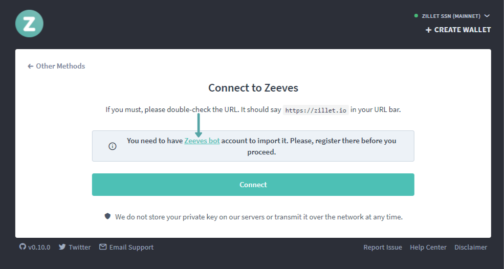

# How to Connect Your Wallet with Zeeves

### Steps required to connect to Zeeves Bot

* Go to <https://zillet.io/>
* On the front page down under the `"zeeves"` click connect.
* Add `"Zeeves Bot"` to your telegram account.
    
* Go to your telegram app Click the `"Start"` button on Zeeves   chat.
* Tap on `"Import Account"` and Open the Link.
* It will ask you to add/import your wallet By.
    1. Private Key
    2. Wallet QR code
* Select the  `"Private Key"` or `"Wallet QR code"` option to connect.
    - Add Your Wallet Private Key
    - Create Password
    - Add your E-mail ID
    - Click the `"Create An Account"`
    - You're done!
* Now Open Zeeves on <https://zillet.io/>
    - Click the `"Connect"`
    - You will receive authentication code on Telegram.
* You're all set now to Login with Zeeves.

## Related articles

* [Protecting yourself and your funds](/staying-safe/protecting-yourself-and-your-funds)