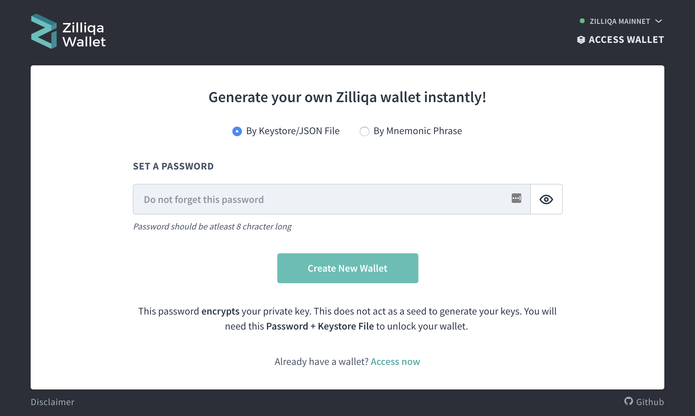

# How To Create a New Wallet

* Go to <https://zillet.io/create>.

* Select an option for a type of wallet to create. 

### Generate a keystore file

1. Enter a strong password. Using a randomly-generated password is recommended. Make sure that you write this password down on multiple pieces of paper! Place the paper somewhere safe!
   * You can also create a text file on a USB and save your password there.
   * *This password encrypts (protects) your private key. It does not generate your private key. This password alone will **not** be enough to access your Zilliqa Token.*

2. Enter the password again to confirm it.

3. Click the `"Create New Wallet"` button.

4. Download your `Keystore File`:
   * Save this file to a USB drive.
   * *This is the encrypted version of your private key. You need the password to access it. It is safer than your unencrypted private key but you must have your password to access it in the future.*

5. Read the warning. If you understand it, click the `"Continue"` button.

6. Print your paper wallet backup.

7. Print out the current page to save your private key by using your web browser's print option.
   * You can write it out by hand, but it is not recommended. *If you do choose to write it down, it is recommended you write it 2 or 3 times. This decreases the chance your messy handwriting will prevent you from accessing your wallet later.*

8. Copy & paste your address into a text document and save it.

### Mnemonic phrase

1. Click the `"Generate a Mnemonic Phrase"` button.

2. Write down the 12-word phrase that you have listed.

3. Print your paper wallet backup.

4. Click the `"I Wrote Down My Mnemonic Phrase"` button.

Congratulations! You've successfully created a wallet!

## Things to double check

* Unlock your new wallet using the method you chose to generate your wallet: Keystore File or Mnemonic Phrase.  Ensure it unlocks the wallet you generated and that the address matches the one you bookmarked.
  * *Do not simply leave your new wallet open. Pretend you are coming back a year later to access your riches. Can you do it?*

* Send a small amount of Zilliqa Token (1 ZIL) from your previous wallet or exchange to your new wallet's public address (the one beginning with '0x').

* Send a small amount of Zilliqa Token (1 ZIL) from this new wallet to another address.
  * *Perhaps our donation address? We are a free, open-source service. There are no fees, no ads, no tracking, no cookies, no selling your data.*

* Ensure you have recorded all necessary bits of information and the addresses match at all times. If they don't, you miswrote something somewhere. That means it's time to start from the beginning in order to make sure you never lose access to your funds.

Doing all of this is tedious, but it ensures (1) you have complete access to your funds, (2) the address you sent to is correct and matches the private key you have saved, and (3) you can rest easily for years to come, knowing you will be able to access your ZIL later.

### Safe storage of backups

It is recommended that you store backups of both forms of your key (the Keystore or Mnemonic Phrase and paper wallet version) in physically separate, offline environments.

This prevents loss of the private key and password due to a dead hard drive, lost USB drive, wet piece of paper, etc. Keep in mind that physical loss can affect an entire geographical area (e.g., fire, flood).

### Zillet cannot recover your key

Zillet is not a web wallet and cannot recover your private key or password, access your account, move funds, recover funds, nor cancel/reverse transactions.

We are a client-side interface that allows you to interact with the Zilliqa blockchain. Please secure and back up your key like the millions of dollars it could someday be worth.

## Related articles

* [What is the difference between private key & Keystore / UTC file?](/general-knowledge/ethereum-blockchain/difference-between-wallet-types)
* [Protecting yourself and your funds](/staying-safe/protecting-yourself-and-your-funds)
