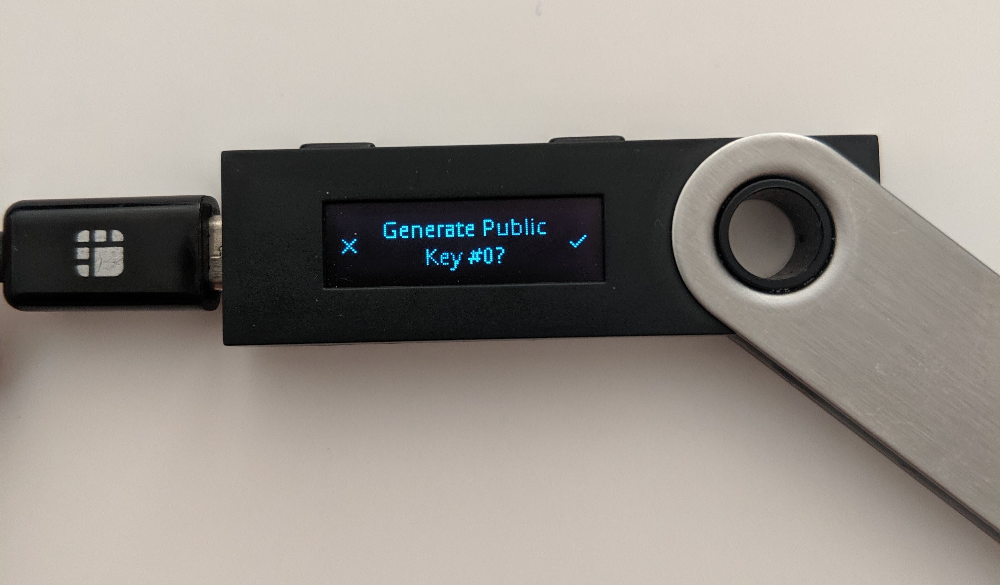

# How to use your Ledger Nano S with Zillet

**Important**: You can read the original blog on the medium [here](https://blog.zilliqa.com/a-guide-to-zilliqa-ledger-nano-s-app-cd2fdeb05676).

### __To install the Ledger Nano S app:__

**Step 1.** Download Ledger Live on your computer using [this link](https://shop.ledger.com/pages/ledger-live).

**Step 2.** Navigate to the *Manager* tab within the Ledger Live app and confirm the access to your Ledger on your hardware wallet;

**Step 3.** Search for Zilliqa in the application store search bar, and download the Zilliqa Ledger Nano S app by clicking download.

**Step4.** You’re done!You have successfully installed the Zilliqa Ledger Nano S application!

### __To connect Zillet with Ledger Hardware Wallet:__

**Step 1.** On the front page, select ‘Access Wallet’.

**Step 2.** Choose the ‘Ledger’ option to connect.

**Step 3.** Select account index you want to access, by default it is set to 0 and click on the “CONNECT” button. You will then be prompted to confirm the generation of the public key on your Ledger Nano S device.

**Step 4.** Confirm by pressing the right button and you shall see your imported wallet address on Zillet!

**Step 5.** You’re done!
