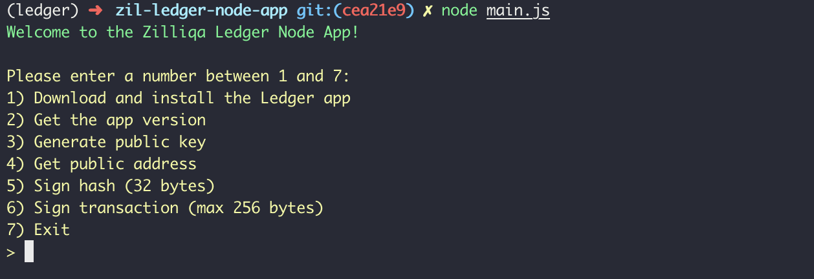

# How to use your Ledger hardware wallet with Zillet

**Important**: In order to use the Ledger app, you will need to manually install it currently as it is not supported on Ledger Live yet.

#### How to manually install Zilliqa Ledger App

First, install [Node JS](https://nodejs.org/en/) on your computer. Then, clone the NodeJS-based command line application via the instructions shown below:

```sh
 $ git clone https://github.com/CryptoAeon/zil-ledger-node-app.git
  $ cd zil-ledger-node-app/
  $ npm install # install dependencies
  $ node main.js
```

You will then be welcomed with the following Options.



- Install the Ledger Nano S application by entering the Option 1
- You will be prompted with a screen "Allow Unknown Manager" on the Ledger Nano S device. Right click on the device to install
- Enter your PIN for the Ledger Nano S device to authorise the installation
- A success code will be shown on this companion app's command line:
```
Installation successful!
{
  "exitCode": 0
}
```

### __To connect Zillet with Ledger Hardware Wallet:__

**Step 1.** On the front page, select ‘Access Wallet’.

**Step 2.** Choose the ‘Ledger’ option to connect.

**Step 3.** Select account index you want to access, by default it is set to 0 and click on the “CONNECT” button. You will then be prompted to confirm the generation of the public key on your Ledger Nano S device.


**Step 4.** Confirm by pressing the right button and you shall see your imported wallet address on Zillet!

**Step 5.** You’re done!
